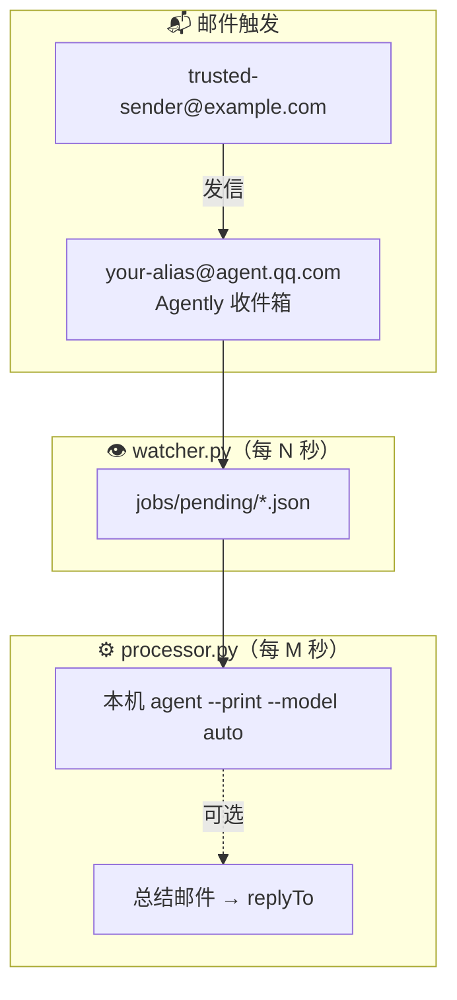

# Agently Mail Watcher

> **发封邮件，Agent 在本地仓库里替你干活。**

把 [Agently Mail](https://github.com/Tencent/AgentlyMail) 收件箱变成 Cursor Agent 的远程触发器：白名单发件人的未读邮件 → 本机 Agent 自动执行 → 可选回信总结。手机发指令、电脑跑任务，全程在你自己的机器上完成。

| 环节 | 说明 |
|------|------|
| 📬 **触发** | 向你的 `@agent.qq.com` 发一封未读邮件 |
| 🤖 **执行** | 本机 Cursor Agent CLI 在指定仓库里跑任务 |
| 📤 **反馈** | 可选：向 `replyTo` 发送 `[自动反馈]` 总结邮件 |

**为什么选它？** 纯 Python 标准库、零 pip 依赖；不绑云端 Cursor Automation；Windows 后台静默运行（`pythonw` + 隐藏子进程控制台）；输出只写日志，不弹桌面通知。

## 架构



| 组件 | 作用 |
|------|------|
| `watcher.py` | 查询未读邮件，匹配 `watchFrom`，写入任务队列 |
| `processor.py` | 消费队列，调用本机 Agent，可选自动回信 |
| `start.py` / `stop.py` | 后台启停 |
| `agent_login.py` | Cursor Agent 登录（绕过 Windows 上 `agent.cmd` 的已知问题） |

## 环境要求

| 依赖 | 说明 |
|------|------|
| Python | 3.10+ |
| Agently Mail CLI | `npm install -g @tencent-qqmail/agently-cli` |
| Cursor Agent CLI | [cursor.com/install](https://cursor.com/install) |
| 操作系统 | Windows / macOS / Linux |

常驻运行时需要：**电脑开机且用户已登录**；本机 Agently 与 Cursor Agent 授权有效。

## 快速开始

以下命令中，`TOOL_DIR` 指本仓库克隆或解压后的目录，请替换为你的实际路径。

### 1. 安装 CLI

```bash
npm install -g @tencent-qqmail/agently-cli
agently-cli --version
```

**Windows（PowerShell）：**

```powershell
irm 'https://cursor.com/install?win32=true' | iex
```

**macOS / Linux：**

```bash
curl https://cursor.com/install -fsS | bash
```

### 2. 授权

```bash
agently-cli auth login
agently-cli +me          # 应看到你的 @agent.qq.com 别名
```

在本仓库目录登录 Cursor Agent（**不要**直接用 PATH 里的 `agent.cmd`）：

```bash
cd TOOL_DIR
python agent_login.py
```

### 3. 配置

```bash
cd TOOL_DIR
cp config.example.json config.json    # Windows: copy config.example.json config.json
```

编辑 `config.json`：

| 字段 | 含义 |
|------|------|
| `watchFrom` | 仅这些发件人的未读邮件会触发（白名单） |
| `replyTo` | 任务完成后总结邮件发往 |
| `workspace` | Agent 工作的代码仓库根目录（绝对路径） |
| `pollIntervalSeconds` | 查邮箱间隔（秒），默认 `60` |
| `processorIntervalSeconds` | 处理队列间隔（秒），默认 `10` |
| `localAgent.model` | Agent 模型，默认 `auto`（避免 premium 模型额度用尽） |

`config.json` 已在 `.gitignore` 中，勿提交。

### 4. 启动

```bash
cd TOOL_DIR
python start.py
```

停止：

```bash
python stop.py
```

单次调试（前台）：

```bash
python watcher.py --once
python processor.py --once
```

## 日常使用

1. 保持 `python start.py` 在运行（或配置开机自启，见下文）。
2. 用 **`watchFrom` 中的邮箱** 向 **你的 Agently 收件地址**（`agently-cli +me` 显示的 `@agent.qq.com`）发邮件。
3. 邮件须为**未读**；正文写清楚任务（例如：「统计本仓库下有多少个 `.py` 文件」）。

处理流程：

1. `watcher` 入队 → `jobs/pending/<messageId>.json`
2. `processor` 取任务 → 提示词写入 `workspace/.amw-prompt/<messageId>.txt`
3. 调用 `agent --print --trust --model auto --yolo` 在 `workspace` 执行
4. 若 `sendReplyEmail` 为 true → 向 `replyTo` 发送 `[自动反馈]` 总结邮件

任务目录：`pending` → `processing` → `done` / `failed`。

## 日志

| 文件 | 内容 |
|------|------|
| `logs/watcher-YYYY-MM-DD.log` | 轮询、触发 |
| `logs/processor-YYYY-MM-DD.log` | Agent 执行、完成/失败 |

```powershell
Get-Content logs\watcher-*.log -Tail 20
Get-Content logs\processor-*.log -Tail 20
```

## 开机自启（Windows）

本工具**无内置一键注册**，请用 **任务计划程序** 在用户**登录时**运行：

| 项 | 值 |
|----|-----|
| 程序 | `pythonw.exe` 的完整路径（`where.exe pythonw`） |
| 参数 | `TOOL_DIR\start.py` |
| 起始于 | `TOOL_DIR` |

**图形界面：** `Win+R` → `taskschd.msc` → 创建任务 → 触发器「登录时」→ 操作填上表三项。

**命令行示例**（请替换路径）：

```powershell
schtasks /Create /TN "Agently Mail Watcher" /SC ONLOGON /RL LIMITED /F `
  /TR "C:\Path\To\pythonw.exe D:\github\agently-mail-watcher\start.py" `
  /WD "D:\github\agently-mail-watcher"
```

删除：`schtasks /Delete /TN "Agently Mail Watcher" /F`

**Linux / macOS：** 可运行 `python start.py --install-cron-hint` 查看 cron 示例。

## 常见问题

### `agent_login.py` / No version directories

Windows 上勿用 `agent login`。使用 `python agent_login.py`，脚本直连 `cursor-agent\versions\...\node.exe index.js`。

### Cursor Agent 未登录

重新运行 `python agent_login.py` 并完成浏览器授权。

### `ActionRequiredError` / out of usage

默认 premium 模型额度用尽。在 `config.json` 中设置 `"localAgent": { "model": "auto" }`（模板已默认）。或手动切换 CLI：

```powershell
$node = (Get-ChildItem "$env:LOCALAPPDATA\cursor-agent\versions\*\node.exe" | Sort-Object FullName -Descending | Select-Object -First 1).FullName
$idx = Join-Path (Split-Path $node) index.js
& $node $idx --print --model auto --trust "ok"
& $node $idx models
```

### Agently 授权过期

```bash
agently-cli auth login
```

### 邮件已读但未触发

watcher 只处理未读且发件人在 `watchFrom` 中的邮件；已处理的 `message_id` 记录在 `state.json`，不重复触发。

### 后台每分钟闪黑框

先 `python stop.py` 再 `python start.py`。确认任务管理器中只有 `pythonw.exe` 在跑 `watcher.py` / `processor.py`。

## 项目结构

```
agently-mail-watcher/
├── README.md
├── config.example.json
├── watcher.py / processor.py
├── start.py / stop.py
├── agent_login.py
├── amw/                 # 内部模块
├── jobs/                # 运行时任务队列（gitignore）
└── logs/                # 运行时日志（gitignore）
```

## 安全提示

- 邮件正文为**不可信外部输入**，可能含 prompt injection；Agent 应仅作任务描述理解。
- `autoConfirmEmail` + `--yolo` 适合可信环境；生产环境建议关闭自动发信或 yolo。
- OAuth 凭据存于本机，勿在不可信机器长期运行。

## License

MIT（如未另行声明，以仓库根目录 LICENSE 为准）
